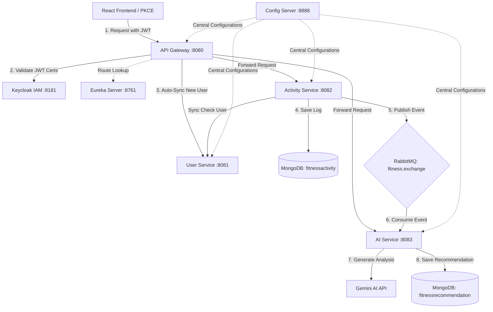

# FitTrack AI: Event-Driven Fitness Tracking Microservices Stack

FitTrack AI is a production-grade, cloud-native full-stack microservices ecosystem designed to log workouts, manage user profiles securely, and deliver personalized, AI-driven training recommendations. 

The architecture features centralized service discovery and routing, asynchronous event-driven messaging, polyglot databases (SQL + NoSQL), secure OAuth2 authentication with Keycloak, and integration with the Gemini AI LLM.

---

## 🛠️ Technology Stack

| Component | Technology | Description |
| :--- | :--- | :--- |
| **Language & Runtime** | Java 21 (LTS), Node.js | Enterprise runtime environment |
| **Framework** | Spring Boot 3.4.x, React 19 | Core backend and frontend frameworks |
| **Service Mesh** | Spring Cloud Eureka, Spring Cloud Gateway | Service discovery, routing, and filtering |
| **Config Management** | Spring Cloud Config Server (Native) | Centralized, profile-based configuration |
| **Messaging & Async** | RabbitMQ | Decoupled event-driven message brokerage |
| **Primary Relational DB** | PostgreSQL | ACID-compliant storage for user records |
| **Document/NoSQL DB** | MongoDB | High-throughput storage for activities & AI insights |
| **Security & IAM** | Keycloak, OAuth2 (Authorization Code + PKCE), JWT | Single-Sign-On (SSO) and API security |
| **AI Processing** | Google Gemini API via Spring WebClient | Intelligent fitness analyses and planning |
| **Frontend State / UI** | Redux Toolkit, React Router 7, Material UI (MUI) | State management and modern UI componentry |

---

## 📐 System Architecture

Below is the design flow showing how requests are routed, secured, synchronized, and processed asynchronously across the microservices:



---

## 🚀 Key Architectural Patterns & Features

### 1. Just-In-Time (JIT) Identity Provisioning
To avoid complex dual-registration procedures, the **API Gateway** intercepts authorized requests using a custom `KeycloakUserSyncFilter`. When Keycloak issues a JWT token to a user, the gateway extracts user metadata from the claims (`email`, `sub`, `given_name`, `family_name`) and calls the `UserService` to register them automatically if they do not yet exist in the relational database.

### 2. Decoupled Event-Driven Workflows
When a user finishes a workout and logs it:
- The **Activity Service** saves the raw log to MongoDB and immediately responds with a success status to keep the client responsive.
- Simultaneously, it publishes a message containing workout data to `fitness.exchange` with routing key `activity.tracking`.
- The **AI Service** consumes the event, constructs an optimized prompt context, calls the Gemini API to get structured workout feedback, and saves the resulting analysis to its own MongoDB collection asynchronously.

### 3. Polyglot Persistence
- **PostgreSQL**: Used by the `UserService` because user account structures require relational consistency, integrity constraints, and transactional safety.
- **MongoDB**: Used by the `ActivityService` and `AIService` because workout logs and AI-generated insights are document-structured, nested, and benefit from NoSQL horizontal scaling as workout volume grows.

### 4. Resilient Config Management
Configurations are centralized within a dedicated **Config Server**. Microservices request configuration profiles dynamically at boot time, enabling smooth environment transitions (Development ➜ Staging ➜ Production) without rebuilding project binaries.

---

## 📦 Microservices Breakdown

- **[eureka](file:///Users/vishwajit/Desktop/fitness-app-microservices/eureka)**: Service registry to register and discover instances of all other microservices dynamically.
- **[configserver](file:///Users/vishwajit/Desktop/fitness-app-microservices/configserver)**: Distributed configuration manager reading configuration files natively from classpath.
- **[gateway](file:///Users/vishwajit/Desktop/fitness-app-microservices/gateway)**: The singular entry point. Employs a WebFilter for JIT user syncing and routes endpoints to internal services.
- **[userservice](file:///Users/vishwajit/Desktop/fitness-app-microservices/userservice)**: Manages profile structures, relational user details, and supports query-validation endpoints.
- **[activityservice](file:///Users/vishwajit/Desktop/fitness-app-microservices/activityservice)**: Registers daily physical activities and publishes message events to the RabbitMQ exchange.
- **[aiservice](file:///Users/vishwajit/Desktop/fitness-app-microservices/aiservice)**: Asynchronously handles workout analysis prompts, connects with Google's Gemini models, and saves detailed wellness suggestions.
- **[fitness-app-frontend](file:///Users/vishwajit/Desktop/fitness-app-microservices/fitness-app-frontend)**: Modern React UI styled with Material-UI components and secured via PKCE OAuth tokens.

---

## 🏃 Local Setup & Startup Guide

### Prerequisites
- Java 21 (JDK 21)
- Node.js (v18+)
- Docker and Docker Compose

### Step 1: Boot Up the Infrastructure Database & Brokers
Run the following command at the project root to spin up PostgreSQL, MongoDB, RabbitMQ, and Keycloak:
```bash
docker compose up -d
```

### Step 2: Set Your Gemini API Key
Export the environment variables for your AI service:
```bash
export GEMINI_API_URL="https://generativelanguage.googleapis.com/v1beta/models/gemini-1.5-flash:generateContent?key="
export GEMINI_API_KEY="your_actual_gemini_api_key_here"
```

### Step 3: Compile and Start the Microservices
Navigate into each microservice directory and start it using the Maven wrapper. Start them in the following order:

1. **Eureka Server**
   ```bash
   cd eureka && ./mvnw spring-boot:run
   ```
2. **Config Server** (Wait for Eureka to be fully up)
   ```bash
   cd ../configserver && ./mvnw spring-boot:run
   ```
3. **User Service**
   ```bash
   cd ../userservice && ./mvnw spring-boot:run
   ```
4. **Activity Service**
   ```bash
   cd ../activityservice && ./mvnw spring-boot:run
   ```
5. **AI Service**
   ```bash
   cd ../aiservice && ./mvnw spring-boot:run
   ```
6. **API Gateway**
   ```bash
   cd ../gateway && ./mvnw spring-boot:run
   ```

### Step 4: Run the React Frontend
Navigate to the frontend directory, install dependencies, and start the development server:
```bash
cd ../fitness-app-frontend
npm install
npm run dev
```
Open [http://localhost:5173](http://localhost:5173) in your browser.

---

## 🔗 Main API Routes Reference

All API calls are exposed securely through the **Gateway** at port `8080`:

| HTTP Method | API Path | Service | Description | Auth Required |
| :--- | :--- | :--- | :--- | :--- |
| **GET** | `/api/users/{userId}` | User Service | Fetches user profile data | Yes |
| **POST** | `/api/users/register` | User Service | Registers a new user | Yes |
| **GET** | `/api/activities/user/{userId}` | Activity Service | Retrieves all activities for a user | Yes |
| **POST** | `/api/activities` | Activity Service | Logs a workout and triggers AI recommendation | Yes |
| **GET** | `/api/recommendations/user/{userId}` | AI Service | Retrieves history of AI-generated training recommendations | Yes |
